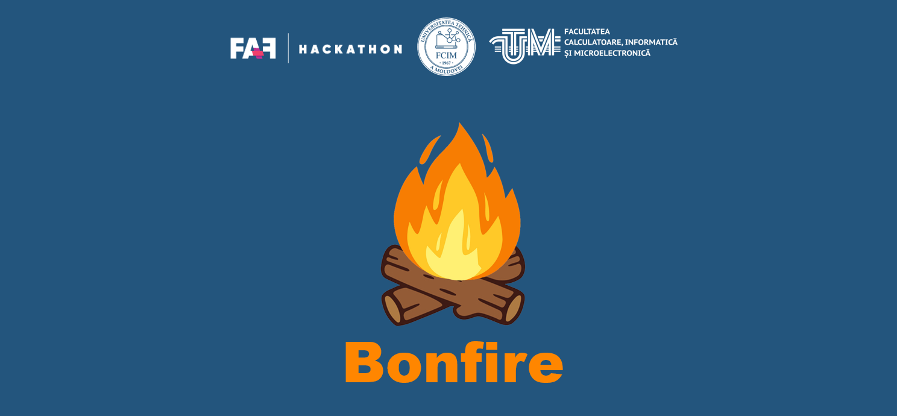

  

<h1 align="center">Hackathon FAF UTM 2022</h1>

Bonfire

##  Developer utility sectioin:
- site link - https://hackathonutm2022.github.io/hackathon/
- site user api -https://hackathonutm2022.github.io/hackathon/users.josn
- site events api -https://hackathonutm2022.github.io/hackathon/events.json

- users api    - https://62adc88a645d00a28aff9ee5.mockapi.io/users
- events api   - https://62adc88a645d00a28aff9ee5.mockapi.io/events

